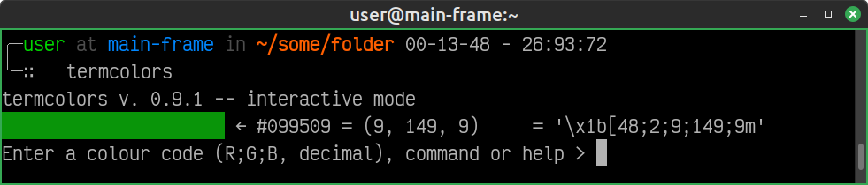

# termcolors

Simple terminal color chooser and ANSI code generator utility for Linux,
written in Python.

## Overview

`termcolors` is a small shell utility for working with true-color (24-bit)
ANSI escape sequences in the terminal. It provides a simple way to generate
foreground or background ANSI codes from RGB color values.

## Features

- Convert colors, passed as `RR;GG;BB` strings, to ANSI sequences
- Support for foreground and background colors
- Batch input (see [Usage](#usage))
- Named palettes generation (see [Usage](#usage))
- Defined input format based on semi-colon separated RGB triplets
- Designed as a terminal application.

## Dependencies

- `pyperclip`

## Installation

```bash
pip install termcolors
```

Or install from source:
```bash
pip install -e .
```

## Usage

- Interactive mode: running `termcolors` without arguments prompts the user
for input (e.g. `9;149;9`).

- Batch input: `termcolors -f <file>`, where `<file>` is an `.ssv` file
containing color codes -- each line should be of the form `RR;GG;BB;<fmt>`,
`<fmt>` being one of `decm`, `hexa` or `prct`.

- Named palette generation -- if `.ssv` files[^1] are stored, `termcolors` will
automatically generate a palette from them, displaying a menu to choose from.

### Basic usage

```shell
╭─user at main-frame in ~/some/folder 00-13-48 - 26:93:72
╰─∷   termcolors
termcolors v. 0.9.1 -- interactive mode
Enter a colour code (R;G;B, decimal), command or help > 9;149;9
```



## Input format

Input semi-colon separated triplets might be in any of the following forms:

- decimal, e.g. `10;90;255` (name: `decm`)
- hexadecimal, e.g. `a;5a;ff` (name: `hexa`)
- percentage, e.g. `0.04;0.355;1` (name: `prct`)

Invalid input values or formats will result in an error.

## License

MIT

[^1]: File with the first line in the form
`# palette: <name>; filename: <filenamename>.ssv` the palette will show
in the menu as a `<name>` option.
